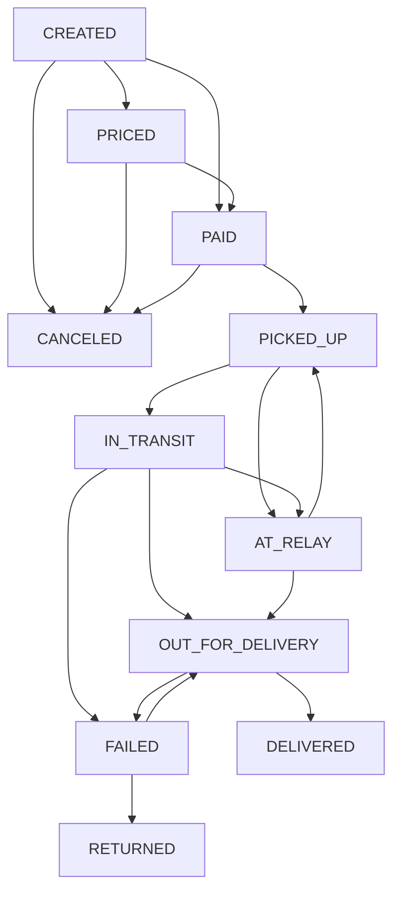

# Machine à États - Module Colis

## États (Enums)
- `created` : Colis enregistré mais non encore tarifié/payé.
- `priced` : Tarif calculé, en attente de paiement.
- `paid` : Payé, prêt pour ramassage.
- `picked_up` : Récupéré par le coursier.
- `in_transit` : En cours de transport vers destination ou relais.
- `at_relay` : Déposé dans un point relais.
- `out_for_delivery` : En cours de livraison finale.
- `delivered` : Livré avec succès (État final).
- `failed` : Échec de livraison.
- `returned` : Retourné à l'expéditeur (État final).
- `canceled` : Annulé (État final).

## Transitions Autorisées

## Règles de Gestion
1.  **Audit Trail** : Chaque transition génère une entrée dans la table `shipment_events`.
2.  **Immuabilité** : Une fois en état `delivered`, `returned` ou `canceled`, plus aucune transition n'est possible.
3.  **Validation** : Le service `ShipmentStateMachine` valide chaque transition avant de l'exécuter en base.
